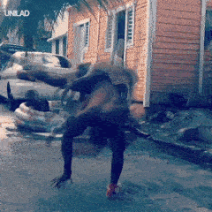

<h3>
<a href="https://woefulwolf.github.io/">
 
im in the basement  
got my programmer socks on  
pls no segfault thanks  
</a>
</h3>
 
 

i did stuff

  

  
    

  

<!--
**WoefulWolf/woefulwolf** is a ✨ _special_ ✨ repository because its `README.md` (this file) appears on your GitHub profile.
-->
